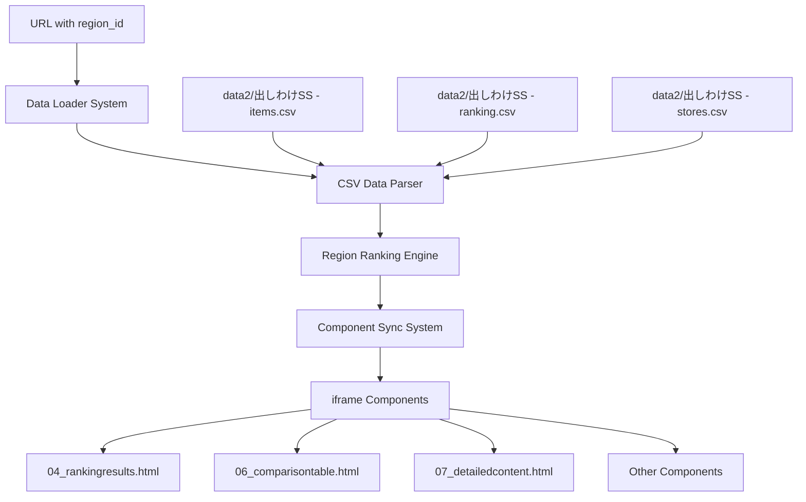

# 設計書

## 概要

地域ベースのクリニック表示システムは、data2フォルダのCSVデータを活用して、region_idパラメータに基づいてクリニックのランキング順序と地域情報を動的に変更するシステムです。既存のランキング同期システムを拡張し、新しいデータソースに対応します。

## アーキテクチャ

### システム構成図



### データフロー

1. **データ読み込み**: CSV ファイルから clinic、ranking、store データを読み込み
2. **パラメータ解析**: URL の region_id パラメータを解析
3. **ランキング決定**: parameter_no に基づいてクリニック順序を決定
4. **コンポーネント更新**: 全 iframe コンポーネントに新しいランキングを配信
5. **表示更新**: 各コンポーネントが地域固有の情報を表示

## コンポーネントとインターフェース

### 1. CSV Data Loader (csv-data-loader-enhanced.js)

```javascript
class CSVDataLoader {
    constructor() {
        this.clinicData = new Map();
        this.rankingData = new Map();
        this.storeData = new Map();
    }
    
    async loadAllData() {
        // CSV ファイルを並列読み込み
        const [clinics, rankings, stores] = await Promise.all([
            this.loadClinicData(),
            this.loadRankingData(), 
            this.loadStoreData()
        ]);
        
        return { clinics, rankings, stores };
    }
    
    async loadClinicData() {
        // data2/出しわけSS - items.csv を読み込み
    }
    
    async loadRankingData() {
        // data2/出しわけSS - ranking.csv を読み込み
    }
    
    async loadStoreData() {
        // data2/出しわけSS - stores.csv を読み込み
    }
}
```

### 2. Region Ranking Engine (region-ranking-engine.js)

```javascript
class RegionRankingEngine {
    constructor(csvData) {
        this.clinicData = csvData.clinics;
        this.rankingData = csvData.rankings;
        this.storeData = csvData.stores;
    }
    
    generateRankingForRegion(regionId) {
        // parameter_no (regionId) に基づいてランキングを生成
        const ranking = this.rankingData.get(regionId);
        if (!ranking) return this.getDefaultRanking();
        
        return this.buildClinicRanking(ranking);
    }
    
    buildClinicRanking(rankingOrder) {
        // ランキング順序に基づいてクリニック情報を構築
    }
    
    getStoresForClinic(clinicId, regionId) {
        // 特定クリニックの地域内店舗情報を取得
    }
}
```

### 3. Enhanced Ranking Sync System (ranking-sync-system-enhanced.js)

既存の RankingSyncSystem を拡張:

```javascript
class EnhancedRankingSyncSystem extends RankingSyncSystem {
    constructor() {
        super();
        this.csvDataLoader = new CSVDataLoader();
        this.rankingEngine = null;
    }
    
    async init() {
        // CSV データを読み込み
        const csvData = await this.csvDataLoader.loadAllData();
        this.rankingEngine = new RegionRankingEngine(csvData);
        
        // 既存の初期化処理を実行
        await super.init();
    }
    
    loadInitialDataFromUrlOrDefault() {
        const urlParams = new URLSearchParams(window.location.search);
        const regionId = urlParams.get('region_id') || '001';
        
        // 新しいランキングエンジンを使用
        this.currentRegionData = this.rankingEngine.generateRankingForRegion(regionId);
    }
}
```

### 4. Region Parameter Handler (region-parameter-handler.js)

```javascript
class RegionParameterHandler {
    constructor() {
        this.currentRegionId = null;
        this.validRegionIds = new Set();
    }
    
    init(validRegionIds) {
        this.validRegionIds = new Set(validRegionIds);
        this.setupUrlParameterHandling();
        this.setupBrowserHistoryHandling();
    }
    
    getRegionIdFromUrl() {
        const params = new URLSearchParams(window.location.search);
        return params.get('region_id');
    }
    
    updateUrlWithRegionId(regionId) {
        const url = new URL(window.location);
        url.searchParams.set('region_id', regionId);
        window.history.pushState({}, '', url);
    }
    
    validateRegionId(regionId) {
        return this.validRegionIds.has(regionId);
    }
}
```

## データモデル

### Clinic Data Model

```javascript
{
    clinic_id: number,
    clinic_name: string,
    code: string
}
```

### Ranking Data Model

```javascript
{
    parameter_no: string, // region_id として使用
    no1: number,          // 1位のclinic_id
    no2: number,          // 2位のclinic_id
    no3: number,          // 3位のclinic_id
    no4: number,          // 4位のclinic_id
    no5: number           // 5位のclinic_id
}
```

### Store Data Model

```javascript
{
    store_id: string,
    clinic_name: string,
    store_name: string,
    zipcode: string,
    address: string,
    access: string
}
```

### Generated Region Data Model

```javascript
{
    id: string,
    name: string,
    clinics: [
        {
            rank: number,
            clinic_id: number,
            name: string,
            code: string,
            stores: [
                {
                    store_name: string,
                    address: string,
                    access: string
                }
            ]
        }
    ]
}
```

## エラーハンドリング

### 1. データ読み込みエラー

- CSV ファイルが見つからない場合のフォールバック
- パース エラー時のデフォルト データ使用
- ネットワーク エラー時のリトライ機構

### 2. パラメータ検証エラー

- 無効な region_id の場合はデフォルト値 ('001') を使用
- 範囲外の parameter_no の場合はデフォルト ランキングを適用

### 3. コンポーネント同期エラー

- iframe 通信失敗時の個別コンポーネント更新
- 部分的な更新失敗時の全体再同期

## テスト戦略

### 1. データ整合性テスト

- CSV データの形式検証
- clinic_id とランキング データの整合性確認
- store データとclinic データの関連性検証

### 2. パラメータ処理テスト

- 有効/無効な region_id の処理確認
- URL パラメータの正しい解析
- ブラウザ履歴との連携確認

### 3. コンポーネント同期テスト

- 全 iframe への正しいデータ配信
- 地域変更時の即座な更新確認
- フォールバック機能の動作確認

### 4. パフォーマンステスト

- 大量データ読み込み時の応答性
- 複数コンポーネント同時更新の効率性
- メモリ使用量の最適化確認